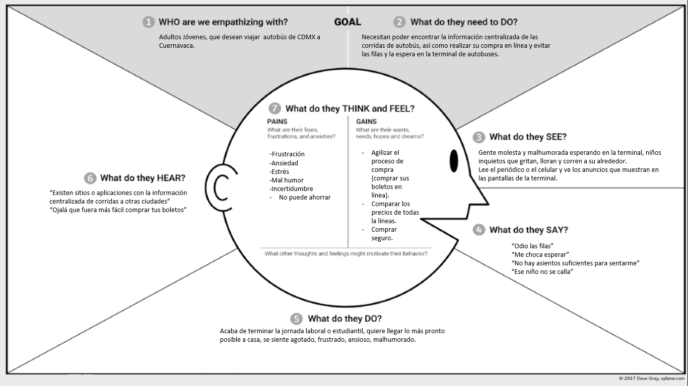
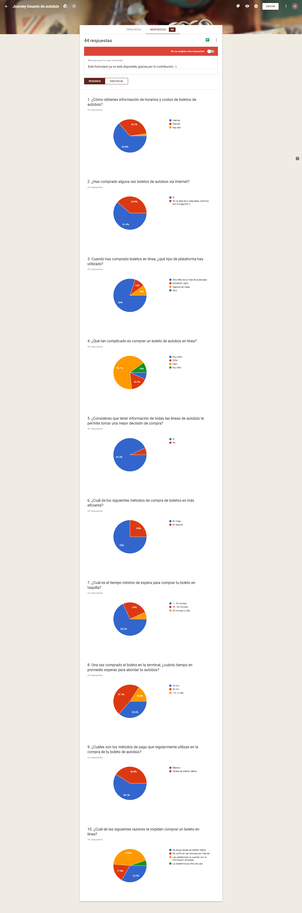
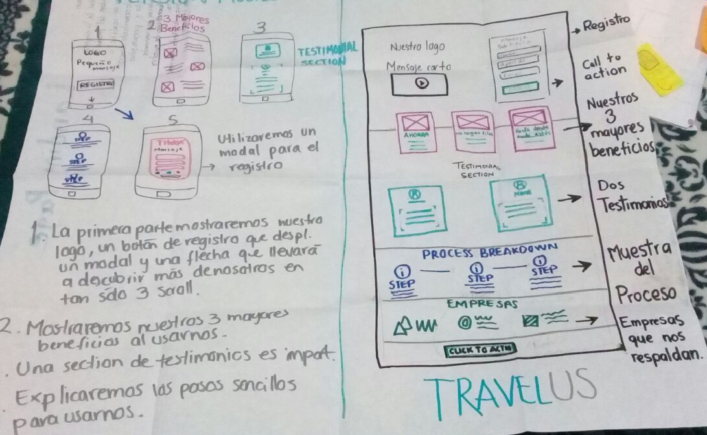
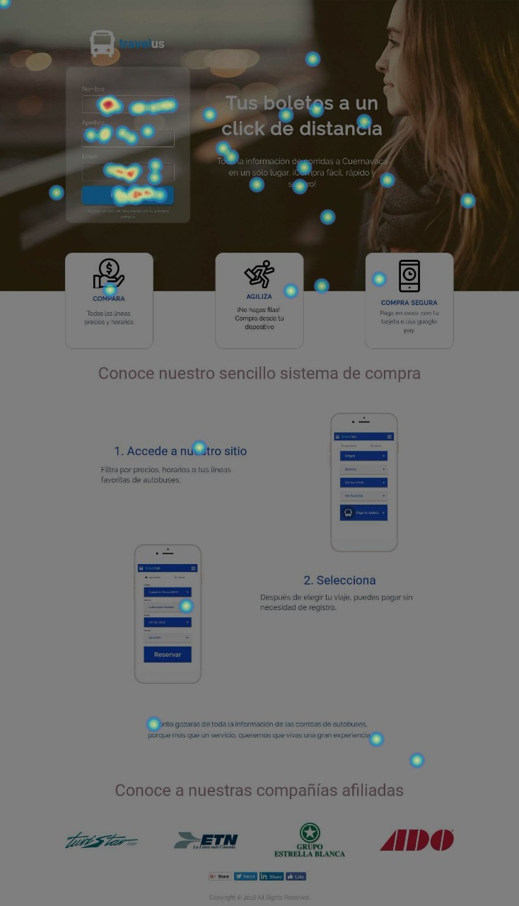
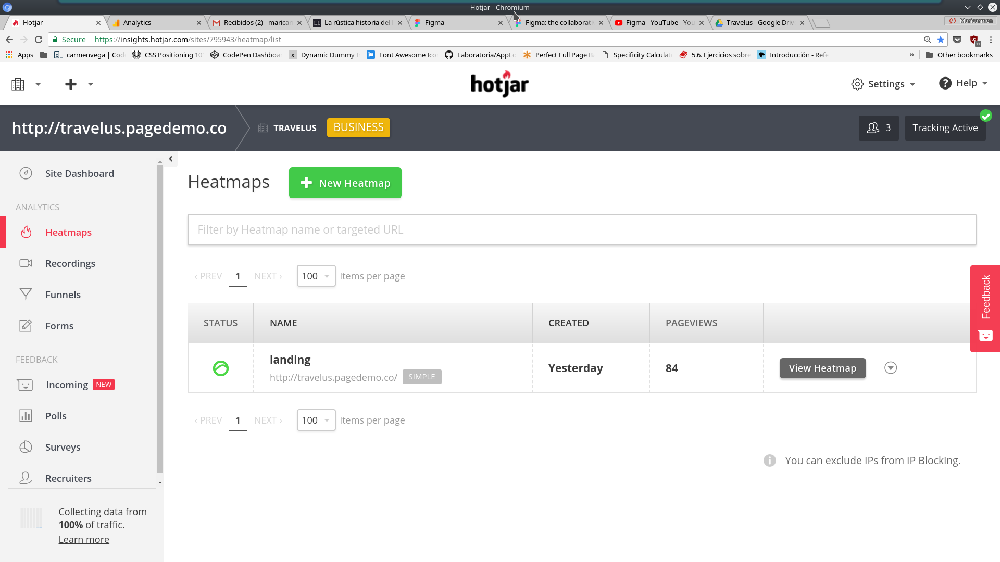
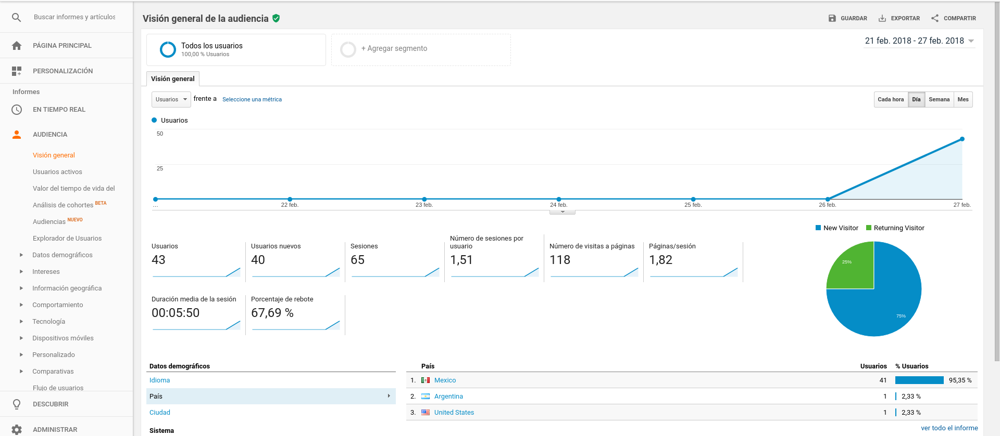

# Sprint 1

**Objetivo**: Optimizar el journey de un pasajero que viaja de la CDMX a Cuernavaca

## TRAVELUS

### Equipo
* PO - Anett Paulina Trujillo Marín
* UX research - Mari Carmen Vega
* UX design - Jazmín Solis

## Empatizar
Se creó un mapa de empatía para entender las necesidades, dolores, problema, etc. del usuario.

### Enunciado del problema
"El usuario  no tiene acceso a la información  centralizada de las corridas de autobús  entre Cuernavaca y CDMX, que le permita optimizar la compra de su boleto."

### Perfil del usuario
ADULTOS JÓVENES
* Edad 18-40 años
* Estudiantes / población económicamente activa
* Familiarizados con la tecnología y las compras en línea
* Viajan a Cuernavaca con fines recreativos, familiares o negocios

### Necesidades del usuario

* Información centralizada
* Ahorrar dinero / optimizar la compra
* Compra segura
* Un sitio web amigable

## Investigación

Se diseñó una encuesta en google forms, con preguntas cerradas de opción múltiple.

#### Insights

* Información incompleta en línea, dificulta el proceso de compra.
* La espera promedio en la terminal es de 45 minutos.
* El usuarios no cuenta con tarjeta de débito/crédito.  Desconfianza en la seguridad de los sistemas de pago online.

## Definición

### ¿Dónde va a vivir el proyecto?
En una plataforma o sitio web, en el que el usuario podrá encontrar la información centralizada de las corridas de autobús de CDMX a Cuernavaca y adquirir su boleto de forma segura.

### Análisis de competencia
* ADO
* Pullman de Morelos

### Objetivo de negocio
Por cada boleto comprado, se cobra a la línea de autobuses una comisión.
Fair trade: nuevos canales de mercado a cambio de nuestro servicio.

## Sketch

## Testing
### Hotjar

#### Datos:
* Heatmaps: 87 vistas en landing
* Recordings: 52 archivos
* Dispositivos: 10 vistas en iOS, 42 vistas en Android.

#### Insights:

* 31 Android  y 8 ios derivaron en registro.
* promedio de navegación 00:02:45,
* Heatmaps: Mayor tráfico en registro y wireframes.
* Herramientas visuales que muestren más información acerca del producto, crean mayor interés en el usuario,  se  refleja en el número de movimientos dentro del landing.

### Google analytics

#### Datos:

* Visión general de la audiencia
* Número de visitas de página: 118
* Porcentaje de rebote: 67%
* Duración media de la sesión: 00:05:50
* Datos demográficos: México 95.35%, Argentina 3.08%, Estados Unidos 1.54%
* Hora de mayor tráfico: 18:00 hrs.
* Dispositivos principales: Móviles 53.8%,  ordenadores 44.6%, tablets 1.5%

#### Insights:

* El 82.76% de nuestros usuarios utilizaron un dispositivo Android, frente a un 17.24% de usuarios de iOS.
* El 65% de las visitas desde android derivaron en el registro.

#### Link de la presentación del proyecto:
[Canva_presentación_proyecto](https://www.canva.com/design/DACwmuHqkf0/n3FqSmpC76poI3P3Chj-Zg/edit?layouts=&category=tACFar75J9E)
